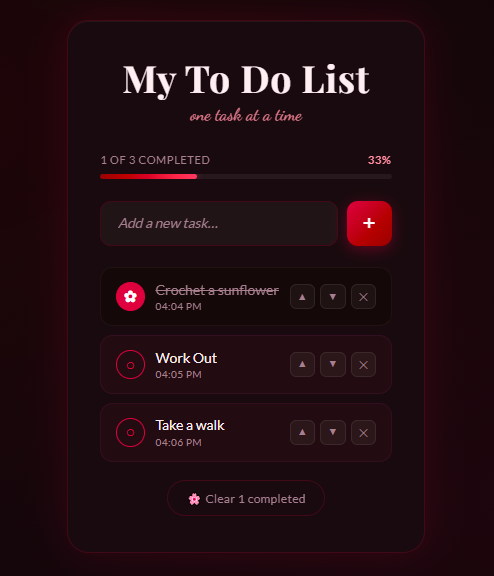

# To-Do List

This project demonstrates my skills in React, component state management, and CSS styling. The app allows users to create, prioritize, and track tasks. This project showcases my ability to work with React hooks, handle user input dynamically, manage component state effectively, and create beautiful, functional user interfaces with attention to design detail.

## Preview



## Features

* Add new tasks with real-time input validation
* Mark tasks as complete instead of deleting
* Reorder tasks using up and down arrow buttons for custom prioritization
* Progress bar displaying completion status
* Timestamps on each task showing when it was created
* Clear all completed tasks with a single button

## Technologies Used

* **React** for building the component-based user interface, including:
   * Hooks (`useState`) for managing task state and input
   * Event handling for user interactions
   * Dynamic list rendering with the `map` function
* **CSS** for styling and animations, featuring:
   * Playfair Display and Dancing Script Google Fonts for elegant typography
   * Smooth transitions and hover effects for interactive feedback
   * Responsive layout with flexbox positioning
* **JavaScript** for core functionality, including:
   * Array methods (`filter`, spread) for task management
   * Event listeners for button clicks and keyboard input
   * Animation triggers based on user actions

## Getting Started

```bash
# Clone the repo
git clone https://github.com/YOUR_USERNAME/task-tracker-app.git
cd task-tracker-app

# Install dependencies
npm install

# Start development server
npm run dev
```
